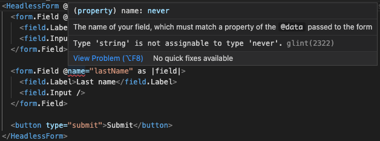

# Using with TypeScript / Glint

This addon is written in TypeScript, and strives to give TypeScript users a first-class experience. It will be mostly used within templates, which TypeScript does not understand unfortunately. Here [Glint](https://github.com/typed-ember/glint) comes to the rescue, which will make strict type checking available in templates.

> While this library adheres and strives for [SemVer](https://semver.org/), TypeScript does not, and Glint still has no stable release. So this addon will not declare its TypeScript/Glint support to be stable _yet_.
> Type changes during minor upgrades may be considered breaking changes to some.
> The goal, is to follow the advice of [Semantic Versioning for TypeScript Types](https://www.semver-ts.org/) eventually. Until noted in the Changelog that our TypeScript types fall under SemVer, consider type changes as "bugfixes" for patch releases.


## Usage with classic templates (hbs)

All the components, which are `<HeadlessForm>` as well as those [yielded from it](./usage), have strict Glint types. In case you are already using _strict mode templates_ via [ember-template-imports](https://github.com/ember-template-imports/ember-template-imports), you only need to import the component from `ember-headless-form/components/headless-form` and you are ready to go. For the more likely case of using classic `.hbs` templates, Glint requires a template registry to be set up, that declares a mapping of component _names_ to their types. This addon follows the [recommendations for Glint-enabled addons](https://typed-ember.gitbook.io/glint/using-glint/ember/using-addons#using-glint-enabled-addons), so add the addon's provided registry to your app's own registry as follows:

```ts
import '@glint/environment-ember-loose';

import type HeadlessFormRegistry from 'ember-headless-form/template-registry';

declare module '@glint/environment-ember-loose/registry' {
  export default interface Registry extends HeadlessFormRegistry {
    // your app's own entries here...
  }
}
```

The same applies for any additional packages of this project if in use, like [`ember-headless-form-yup`](./validation/yup) or [`ember-headless-form-changeset`](./validation/ember-changeset).


## Typing of form data

This addon's types also ensure that your form data matches the form fields you use in your templates. As such it is recommended that you type your form data in a strict and explicit way. Make sure to mark properties as optional, if they are not guaranteed to be filled out initially.

In other words, you cannot use a field with a `@name` which does not have a corresponding property on `@data`. Take the following example:

```hbs
<HeadlessForm @data={{this.data}} @onSubmit={{this.handleSubmit}} as |form|>
  <form.Field @name='firstName' as |field|>
    <field.Label>First name</field.Label>
    <field.Input />
  </form.Field>

  <form.Field @name='lastName' as |field|>
    <field.Label>Last name</field.Label>
    <field.Input />
  </form.Field>

  <button type='submit'>Submit</button>
</HeadlessForm>
```

```ts
import Component from '@glimmer/component';

export default class MyFormComponent extends Component {
  // notice there is no firstName or lastName key in data
  data = {};

  handleSubmit({
    firstName,
    lastName,
  }: {
    firstName: string;
    lastName: string;
  }) {
    // do something
  }
}
```

Glint will show an error with the following, because `data` has a type of an empty object (`{}`), so neither `firstName` nor `lastName` are known properties:



The correctly typed version of the component definition of the previous example would look like this:

```ts
import Component from '@glimmer/component';

interface MyFormData {
  firstName?: string;
  lastName?: string;
}

export default class MyFormComponent extends Component {
  data: MyFormData = {};

  handleSubmit({ firstName, lastName }: MyFormData) {
    // do something
  }
}
```

Note that the initial `data` is still an empty object, but it has the explicit type of `MyFormData` (which an empty object is assignable to, as all properties are optional). This will make sure that `firstName` and `lastName` are the only valid properties you can refer to using the field's `@name`, preventing you from accidental errors like typos.
